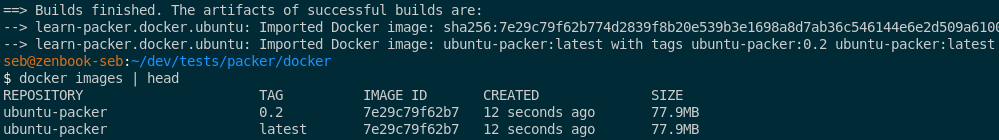

# Documentation de la découverte de l'outil Packer


Le but ici c'est de créer une VM-template pour Proxmox

## Installation Packer

Suivons la documentation https://developer.hashicorp.com/packer/tutorials/docker-get-started/get-started-install-cli,
ajout du repo Hashicorp et install via apt.

On peut également installer l'extension _hashicorp.hcl_ pour VSCode afin d'avoir la syntaxe.

## Utilisation avec Docker

On va utiliser le builder Docker, comme dans le tuto https://developer.hashicorp.com/packer/tutorials/docker-get-started/docker-get-started-build-image

Création du fichier `docker-ubuntu.pkr.hcl`.
Sur le bloc `required_plugins` la version du builder docker requis est 1.0.8.
Malheureseument sur la cli packer, impossible de requeter quoi que ce soit pour avoir des informations sur le builer. Il faut aller sur le site (https://developer.hashicorp.com/packer/integrations/hashicorp/docker)

On peut peut-être envisager une recherche (base url = "https://developer.hashicorp.com/packer/integrations/", ensuite soit "hashicorp/docker" pour officiel, soit "digitalocean/digitalocean" pour partenaire)

> The packer {} block contains Packer settings

> The source block configures a specific builder plugin, which is then invoked by a build block. 
> In the example template, the builder type is docker and the name is ubuntu.


Je me fait un alias:
```shell
alias pprepare='packer init . && packer fmt . && packer validate .'
```

J'ajoute deux blocs de provisioner shell dont un avec un here-doc.

J'ajoute le _post-processor_ `docker-tag` afin de récupérer une image avec un nom et un tag. (https://developer.hashicorp.com/packer/integrations/hashicorp/docker/latest/components/builder/docker#using-the-artifact:-committed)

Utiliser `commit = true` dans `source` associé au _post-processor_ `docker-tag` avec ce paramétrage :

```shell
repository = "ubuntu-packer"
tag        = ["0.2", "latest"]
```
Cela permet d'obtenir une image en local nommée et taggé.




## Utilisation avec Proxmox

Documentation du plugin proxmox (https://developer.hashicorp.com/packer/integrations/hashicorp/proxmox).
On peut utiliser comme builder [proxmox-iso](https://developer.hashicorp.com/packer/integrations/hashicorp/proxmox/latest/components/builder/iso) ou [proxmox-clone](https://developer.hashicorp.com/packer/integrations/hashicorp/proxmox/latest/components/builder/clone)

La différence entre ces deux builders est la source de l'image. Dans le cas de _clone_ on va cloner une machine déjà existante sur l'instance Proxmox. Dans le cas de _iso_ on va récupérer un fichier ISO afin de créer une VM.

On va donc partir sur proxmox-iso afin de créer une VM sans toucher à proxmox.

### Connexion à Proxmox

Je créé un fichier ```.pm_config```. Celui-ci contient les lignes suivantes :

```shell
export PROXMOX_URL="https://<PVE IP>:8006/api2/json"
export PROXMOX_USERNAME="<token>"
export PROXMOX_TOKEN="abcd1234"
```
Ces informations sont à récupérer/créer sur l'instance PVE. 
> NB : Ce ne sont pas les mêmes variables qui sont utilisées par Terraform !

Ce fichier est à sourcer à chaque fois qu'on travaille sur le projet.

> TODO: faire un script d'activation spécial proxmox (à la manière de virtualenv ?)


### Builder

